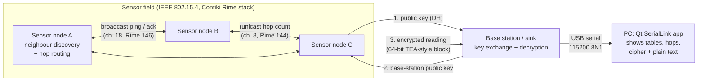
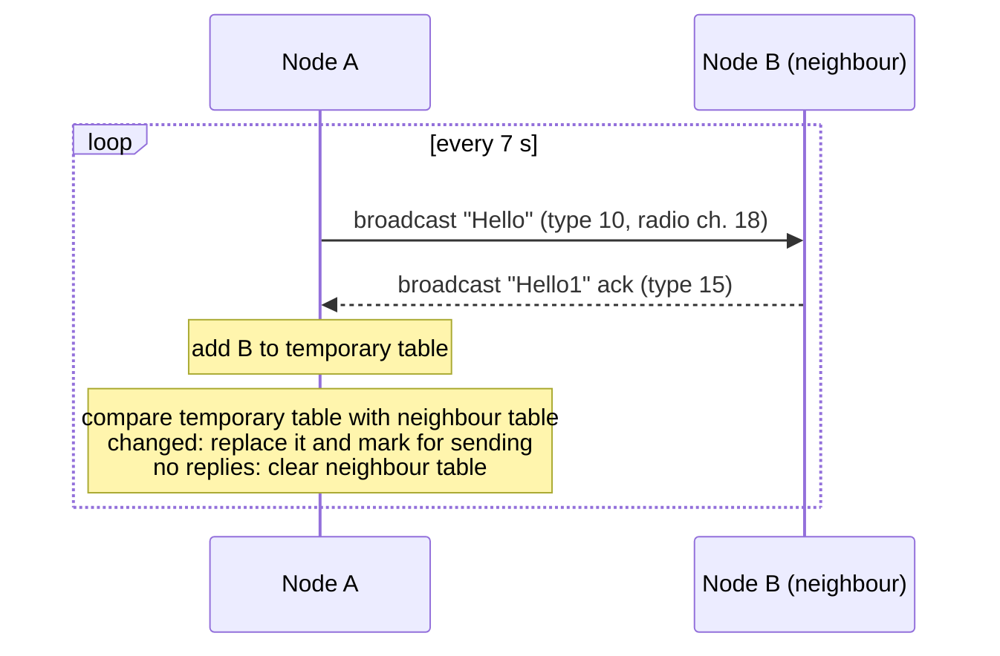
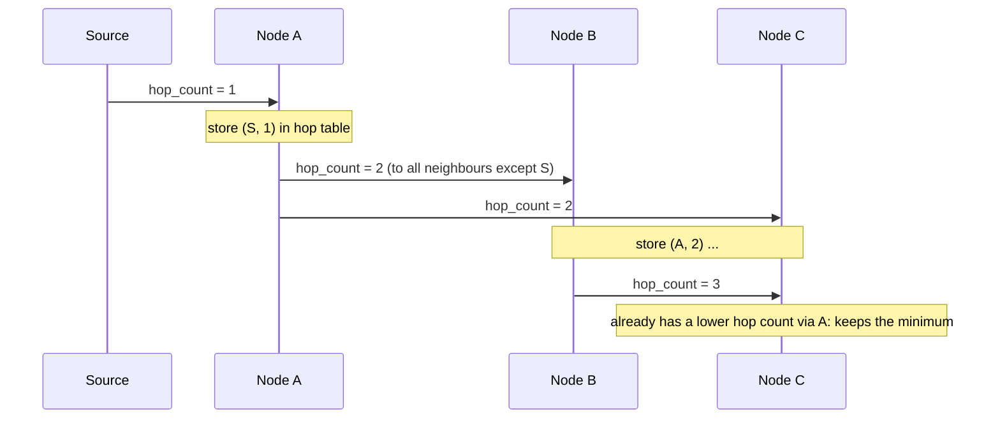
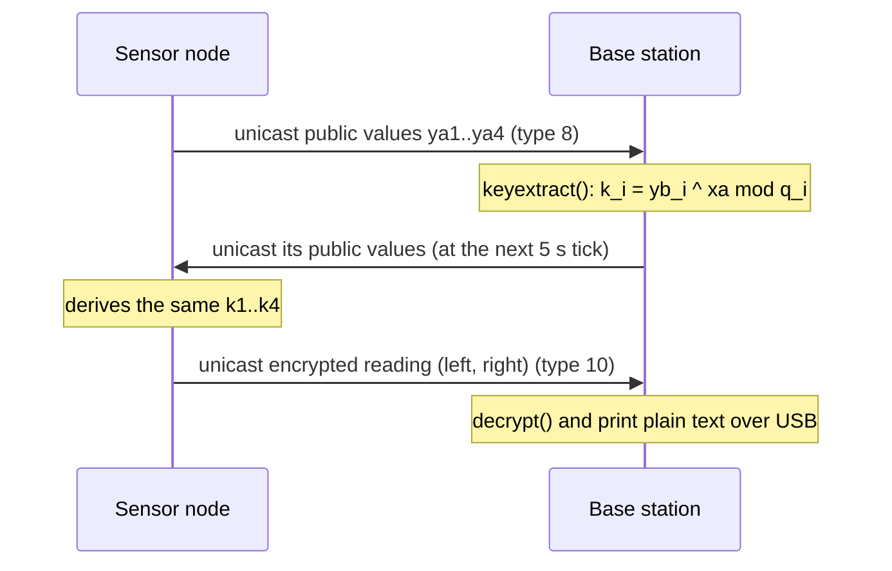

# Secure Multi-Hop Wireless Sensor Network (Contiki)

Firmware for a small **wireless sensor network** in which sensor motes discover
their neighbours, build **hop-count routes** towards each other, agree on a key
with the **base station** (Diffie-Hellman) and send their readings **encrypted**
with a TEA-style block cipher. A **Qt desktop app** connected to a mote over USB
shows what is happening on the network (neighbour tables, hop counts, cipher and
plain text).

Built in 2017 in the *Wireless Sensor Networks Laboratory* at TU München with
**Contiki OS 3.0**; the firmware builds for **Zolertia RE-Mote** motes (TI CC2538,
IEEE 802.15.4 radio).

## System architecture



| Component | Folder | Runs on |
|---|---|---|
| Base station (sink) | [`firmware/base_station/`](firmware/base_station/) | RE-Mote connected to the PC |
| Sensor node v1: neighbour discovery | [`firmware/sensor_node_v1_neighbor_discovery/`](firmware/sensor_node_v1_neighbor_discovery/) | RE-Mote |
| Sensor node v2: discovery + hop-count routing | [`firmware/sensor_node_v2_hop_routing/`](firmware/sensor_node_v2_hop_routing/) | RE-Mote |
| Desktop apps (SerialLink, AmbientTemperature) | [`desktop/`](desktop/) | Linux PC (Qt 5) |
| Cipher reference model + tests | [`tools/cipher/`](tools/cipher/) | Python 3 |

## How it works

### 1. Neighbour discovery (sensor nodes, v1 and v2)

Every node runs the same loop (`periodic_check` process):



Nodes keep two Contiki `LIST`s backed by a `MEMB` pool (max. 100 entries): the
**temporary table** collects everyone who answered this round, and the
**neighbour table** holds the last confirmed set. Neighbours that stop answering
disappear in the next round.

### 2. Hop-count routing (sensor node v2)

After discovery the nodes switch to radio channel 8 and spread hop counts with
**reliable unicast** (`runicast`, up to 4 retransmissions):



Each node keeps a **hop table** `(neighbour address, hop count)`. When a hop
message arrives it:

1. adds the sender, or updates its hop count;
2. if the count is new or not worse than the best known count, forwards
   `hop_count + 1` to every neighbour except the sender.

Every node thus learns how many hops away the source is and through which
neighbour: the basis for forwarding readings to the sink along the shortest path.
Version 1 sends the initial `hop_count = 1` from every node (process `hop_start`);
version 2 adds the hop table and the forwarding logic in `received_hop()`.

### 3. Key exchange and encrypted data (base station)



The base-station side is in `Base_Station.c`. The **sensor-side** counterpart
(sending the public values, deriving the keys, encrypting readings) is not part
of the 2017 files in this repository; the same scheme was implemented on the
sensor side in an earlier TinyOS version, and its `encrypt()` is reproduced in
the cipher model below.

**Key exchange.** Four parallel Diffie-Hellman exchanges with fixed primes
`q = 941083981, 961748941, 492876847, 982451653` and generators 2 and 3 give the
four 32-bit round keys `k1..k4`.

**Cipher.** A 64-bit Feistel cipher in the style of TEA: 32 rounds, constant
`delta = 0x9E3779B9`, and a round function
`F(x) = (((x<<4) ^ rotr(x,5)) + d) ^ x) + (d ^ k)`, where the round key `k` is
picked from `k1..k4` by the round counter (`d & 3` or `rotr(d,11) & 3`).
[`tools/cipher/wsn_cipher.py`](tools/cipher/wsn_cipher.py) documents it and is
tested **bit-exact against the firmware's own `decrypt()`**.

### Message types and radio settings

| Type | Meaning | Sent by | Primitive |
|---|---|---|---|
| 10 | neighbour ping "Hello" / encrypted data to the base station | node | broadcast / unicast |
| 15 | ping acknowledgement "Hello1" | node | broadcast |
| 25 | hop-count advertisement | node | runicast |
| 8 | Diffie-Hellman public values | node / base station | unicast |

| Setting | Value |
|---|---|
| Radio channel | 18 (discovery, base station), 8 (hop routing) |
| Rime channels | 146 (broadcast / unicast), 144 (runicast) |
| Timers | discovery every 7 s, hop phase 14 s later, key reply every 5 s |
| Serial port | 115200 baud, 8N1 |

### Visualisation on the PC

Motes print their state over USB: neighbour and hop tables (`The hop list member
<addr> <hops>`), cipher text and decrypted plain text. The **SerialLink** Qt app
([`desktop/apps/serial_link`](desktop/apps/serial_link)) opens the mote's USB port
and shows this live; it can also send text commands to the mote.
**AmbientTemperature** is the lab's temperature-display app (parses
`Temperature: <milli-degC>` lines).

## Building

### Firmware (Contiki 3.0)

```bash
# toolchain + Contiki 3.0
sudo apt install gcc-arm-none-eabi
git clone --branch 3.0 --depth 1 https://github.com/contiki-os/contiki.git

# Contiki 3.0's CC2538 linker script needs a one-line fix for current GCC versions
sed -i 's/} > FLASH= 0/} > FLASH/' contiki/cpu/cc2538/cc2538.lds

cd firmware/base_station
make TARGET=remote CONTIKI=../../contiki                     # -> Base_Station.bin
make TARGET=remote CONTIKI=../../contiki Base_Station.upload # flash a connected RE-Mote
```

The same works in `sensor_node_v1_neighbor_discovery` and `sensor_node_v2_hop_routing`.
The Makefiles enable the Rime stack (`CONTIKI_WITH_RIME = 1`) and the maths library.

| Image | Flash (text) | RAM (data + bss) |
|---|---|---|
| Base_Station | 25.2 KB | 6.4 KB |
| Neighbor_Discovery (v1) | 22.3 KB | 6.7 KB |
| Hop_Routing (v2) | 23.2 KB | 7.6 KB |

### Desktop apps (Qt 5)

```bash
sudo apt install qtbase5-dev qt5-qmake
cd desktop && mkdir build && cd build
qmake ../WSN_Lab.pro && make
./apps/serial_link/SerialLink
```

or open `desktop/WSN_Lab.pro` in Qt Creator. The serial library QextSerialPort is
bundled in `desktop/third_party/`. The apps list Linux USB ports (`/dev/ttyUSB*`);
on macOS/Windows the port filter in `mainwindow.cpp` needs adapting.

### Cipher tests

```bash
pip install pytest
cd tools/cipher && python -m pytest
```

GitHub Actions builds all three firmware images and both desktop apps, and runs
the cipher tests on every push.

## Known limitations

A lab prototype. Before any real deployment the following would need fixing:

* **Message type in the RSSI attribute.** The firmware marks message types by
  setting `PACKETBUF_ATTR_RSSI` (10, 15, 25, 8). Contiki does not transmit that
  attribute; the receiver's radio overwrites it with the measured signal strength.
  The type checks therefore only match by coincidence. Fix: put a type byte at the
  start of the payload.
* **Key exchange arithmetic.** `powf()` (32-bit float) cannot represent values like
  `yb^23`; the result overflows, so the derived keys do not depend on the secret.
  Fix: integer modular exponentiation (square-and-multiply with 64-bit
  intermediates). The private exponent `xa` is also hard-coded.
* **Cipher choice.** A custom TEA-style cipher without authentication. The CC2538
  has hardware AES; AES-CCM (as in IEEE 802.15.4 security) would give
  confidentiality and integrity.
* **Hop table.** `MinInList()` copies the minimum into the list's first element
  and overwrites it; it should return a pointer without modifying the list.
  `delete_hoptable()` frees entries from the wrong list/pool (it is currently unused).
  In v2 nothing sends the initial `hop_count = 1`, so a source node still needs the
  v1 `hop_start` behaviour.
* **Memory checks.** `update_neighbor_table_members()` checks the wrong pointer
  after `memb_alloc()`, so a full pool is not detected.
* **Fixed addresses.** The base station replies to a hard-coded node address (`0x56.0x16`).

## Repository layout

```
firmware/
  base_station/                       Base_Station.c, Makefile
  sensor_node_v1_neighbor_discovery/  Neighbor_Discovery.c, Makefile
  sensor_node_v2_hop_routing/         Hop_Routing.c (originally new.c), Makefile
desktop/
  WSN_Lab.pro                         Qt project (both apps)
  apps/serial_link/                   serial terminal for the motes
  apps/ambient_temperature/           temperature display
  third_party/qextserialport/         serial-port library (MIT)
tools/cipher/                         Python model of the cipher + tests
.github/workflows/ci.yml              firmware + desktop builds, tests
```

## Licences

* Firmware and tools: MIT, see [LICENSE](LICENSE).
* Desktop apps: based on the TUM WSN Lab templates, © 2014 Chair of Communication
  Networks, TUM, GNU GPL v2 (see file headers).
* QextSerialPort: MIT, see `desktop/third_party/qextserialport/LICENSE`.
